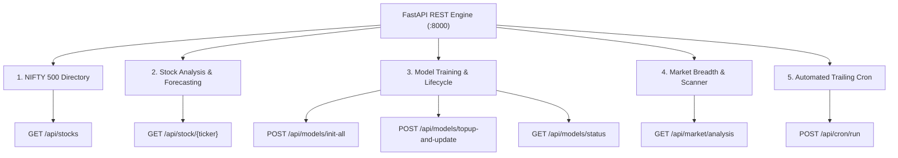

# NIFTY 500 Quantitative Prediction Engine — Swagger / OpenAPI 3.1 Documentation

Interactive API documentation powered by **FastAPI**, **Swagger UI**, and **ReDoc**.

---

## 🚀 Quick Access URLs

| Interface | URL | Description |
| :--- | :--- | :--- |
| **Interactive Swagger UI** | [http://127.0.0.1:8000/docs](http://127.0.0.1:8000/docs) | Complete Swagger UI with "Try it out", schema inspector, and test execution |
| **Case-Insensitive / Aliases** | [http://127.0.0.1:8000/DOCS](http://127.0.0.1:8000/DOCS)<br>[http://127.0.0.1:8000/swagger](http://127.0.0.1:8000/swagger)<br>[http://127.0.0.1:8000/api-docs](http://127.0.0.1:8000/api-docs) | Automatically redirects to `/docs` |
| **ReDoc Clean Reader** | [http://127.0.0.1:8000/redoc](http://127.0.0.1:8000/redoc) | Three-panel responsive documentation reader |
| **OpenAPI Specification (JSON)** | [http://127.0.0.1:8000/openapi.json](http://127.0.0.1:8000/openapi.json) | Raw OpenAPI 3.1 JSON schema |
| **Offline Standalone Swagger** | [`docs/swagger.html`](file:///home/rajesh/Desktop/www/stock-analyser/docs/swagger.html) | Standalone dark-mode HTML documentation runnable in any browser without Python |

---

## 📑 Tag Groups & Endpoints Summary



---

## 1. NIFTY 500 Directory

### `GET /api/stocks`
Returns the directory of NIFTY 500 constituents stored in SQLite with real-time search, industry filtering, latest closing price, and machine learning trend forecasts.

#### Query Parameters:
| Parameter | Type | Required | Default | Description | Example |
| :--- | :--- | :--- | :--- | :--- | :--- |
| `query` | `string` | No | `null` | Search query for Ticker symbol or Company Name | `RELIANCE`, `TATA`, `HDFC` |
| `sector` | `string` | No | `null` | Filter by industry sector | `Financial Services`, `Information Technology` |

#### Response Schema (`200 OK`):
```json
{
  "status": "success",
  "count": 501,
  "stocks": [
    {
      "ticker": "RELIANCE.NS",
      "company_name": "Reliance Industries Ltd.",
      "sector": "Oil Gas & Consumable Fuels",
      "industry": "Refining & Marketing",
      "market_cap": 1850000.0,
      "latest_close": 1167.70,
      "as_of_date": "2026-10-01",
      "trend_signal": "BEARISH",
      "predicted_close": 1163.25,
      "expected_pct_change": -0.38,
      "confidence_pct": 68.4
    }
  ]
}
```

---

## 2. Stock Analysis & Forecasting

### `GET /api/stock/{ticker}`
**Single-Shot Consolidated Endpoint**: In a single low-latency round-trip, delivers:
1. **Fundamental Valuation**: Market Cap (₹ Cr), P/E, P/B, EPS (TTM), Dividend Yield (%), ROE (%).
2. **64+ Technical Indicators**: RSI 14, MACD, Signal, Histogram, SMAs (20, 50, 200), EMAs (9, 21), Bollinger Bands, ATR 14, NATR 14, ADX 14, Floor Trader Pivot Points ($P, R_1, S_1$).
3. **Machine Learning Tomorrow's Forecast**: Predicted Next-Day Close, Expected % Change, Dynamic Confidence Range ($[\text{Low}, \text{High}]$), Trend Direction (`BULLISH` / `BEARISH`), and Probability Confidence (%).
4. **Historical Chart Bars**: Trailing 90 trading sessions with technical overlays.

*Note: Automatically maps Indian ticker variations (e.g., `RELIANCE` $\to$ `RELIANCE.NS`, `TATAMOTORS` $\to$ `TMCV.NS`, `NIFTY` $\to$ `^NSEI`). If the ticker is not yet cached in SQLite, it dynamically bootstraps on-the-fly.*

#### Path Parameters:
| Parameter | Type | Required | Description | Example |
| :--- | :--- | :--- | :--- | :--- |
| `ticker` | `string` | Yes | Stock symbol or alias | `RELIANCE`, `TCS.NS`, `AXISBANK` |

#### Sample Response (`200 OK`):
```json
{
  "status": "success",
  "ticker": "RELIANCE.NS",
  "currency_symbol": "₹",
  "day_change": -19.30,
  "day_change_pct": -1.63,
  "fundamentals": {
    "ticker": "RELIANCE.NS",
    "company_name": "Reliance Industries Ltd.",
    "sector": "Oil Gas & Consumable Fuels",
    "industry": "Refining & Marketing",
    "market_cap": 1850000.0,
    "pe_ratio": 24.5,
    "pb_ratio": 2.8,
    "eps": 48.2,
    "dividend_yield": 0.85,
    "roe": 12.4,
    "last_fundamental_update": "2026-10-03 16:30:00"
  },
  "latest_ohlcv": {
    "ticker": "RELIANCE.NS",
    "date": "2026-10-01",
    "open": 1160.00,
    "high": 1175.50,
    "low": 1158.20,
    "close": 1167.70,
    "volume": 8450000.0
  },
  "technicals": {
    "ticker": "RELIANCE.NS",
    "date": "2026-10-01",
    "rsi_14": 45.2,
    "macd": 3.21,
    "macd_signal": 2.88,
    "macd_hist": 0.33,
    "sma_20": 1180.20,
    "sma_50": 1210.40,
    "sma_200": 1250.60,
    "ema_9": 1172.50,
    "ema_21": 1185.30,
    "bb_upper": 1220.40,
    "bb_middle": 1180.20,
    "bb_lower": 1140.00,
    "bb_bandwidth": 0.068,
    "atr_14": 20.10,
    "natr_14": 1.72,
    "adx_14": 28.4,
    "pivot_p": 1188.40,
    "pivot_r1": 1195.10,
    "pivot_s1": 1180.30
  },
  "prediction": {
    "ticker": "RELIANCE.NS",
    "date": "2026-10-01",
    "target_date": "2026-10-03",
    "reference_close": 1167.70,
    "predicted_close": 1163.25,
    "expected_pct_change": -0.38,
    "range_low": 1153.20,
    "range_high": 1173.30,
    "trend_signal": "BEARISH",
    "confidence_pct": 68.4,
    "champion_model": "Ridge+LogReg"
  }
}
```

---

## 3. Model Training & Lifecycle

### `POST /api/models/init-all`
**Initiates the Creation of All 500 Logistic Regression Models**:
- Checks all 501 NIFTY 500 constituents.
- Ingests historical daily OHLCV bars up to the latest available trading date (last today's data).
- Computes 64+ technical indicators per stock.
- Fits a dedicated `LogisticRegression` direction classifier (and `Ridge` price regressor with `RobustScaler`) on each stock.
- Serializes trained model artifacts to `models_registry/{ticker}.joblib`.
- Generates forward predictions (price target, range, trend signal) into SQLite `predictions`.
- Recomputes market-wide breadth and sector scan.
- Runs asynchronously in the background so the request never times out.

#### Query Parameters:
| Parameter | Type | Required | Default | Description | Example |
| :--- | :--- | :--- | :--- | :--- | :--- |
| `limit` | `integer` | No | `null` | Limit number of stocks (e.g. 25 for rapid testing, or omit for all 501) | `25`, `50` |
| `period` | `string` | No | `"5y"` | Historical data period to ingest if missing from database | `"5y"`, `"2y"` |
| `max_workers` | `integer` | No | `8` | Parallel worker threads for model fitting | `8`, `12` |

#### Sample Response (`202 Accepted`):
```json
{
  "status": "initiated",
  "task": "init_all_models",
  "message": "Batch creation of 501 Logistic Regression models started in background with last today's data.",
  "total_stocks": 501,
  "check_status_url": "/api/models/status"
}
```

---

### `POST /api/models/topup-and-update`
**Top Up Today's Latest Data & Update Model(s)**:
- Checks `MAX(date)` in SQLite for the targeted stock(s).
- Downloads **only today's latest missing daily bar(s)** from Yahoo Finance (zero redundant historical downloads).
- Appends new bars into SQLite `daily_ohlcv`.
- Recalculates technical indicators with today's new closing price, volume, and range.
- Refits/updates the `LogisticRegression` model with today's latest data.
- Produces updated forward forecast for the next trading session.
- Updates universe breadth and sector performance metrics.
- Can target a single stock (e.g. `?ticker=RELIANCE`) or all 500 constituents if `ticker` is omitted.

#### Query Parameters:
| Parameter | Type | Required | Default | Description | Example |
| :--- | :--- | :--- | :--- | :--- | :--- |
| `ticker` | `string` | No | `null` | Target stock symbol (omitted for all 500 stocks) | `RELIANCE`, `TCS`, `AXISBANK.NS` |
| `background` | `boolean` | No | `false` | Run asynchronously in background (recommended when updating all 500 stocks) | `true`, `false` |
| `max_workers` | `integer` | No | `8` | Parallel worker threads | `8` |

#### Sample Response (Single Stock, Synchronous):
```json
{
  "status": "success",
  "message": "Successfully topped up today's data and updated model for TCS.NS.",
  "updated_tickers_count": 1,
  "new_bars_count": 1,
  "ticker": "TCS.NS",
  "latest_prediction": {
    "ticker": "TCS.NS",
    "date": "2026-10-01",
    "target_date": "2026-10-02",
    "reference_close": 2075.00,
    "predicted_close": 2052.18,
    "expected_pct_change": -1.10,
    "range_low": 2023.57,
    "range_high": 2080.79,
    "trend_signal": "BEARISH",
    "confidence_pct": 81.1,
    "champion_model": "Ridge+LogReg"
  },
  "elapsed_seconds": 1.29
}
```

---

### `GET /api/models/status`
**Real-Time Progress & Operational State**:
Returns live progress metrics during batch creation or daily top-up.

#### Sample Response (`200 OK`):
```json
{
  "task_type": "init_all_models",
  "status": "running",
  "progress_pct": 68.4,
  "total_stocks": 501,
  "completed_stocks": 342,
  "failed_stocks": 1,
  "current_ticker": "INFY.NS",
  "started_at": "2026-10-03T22:45:00.123456",
  "completed_at": null,
  "elapsed_seconds": 38.2,
  "message": "Initializing 501 Logistic Regression models with historical data up to today...",
  "details": {}
}
```

---

## 4. Market Breadth & Scanner

### `GET /api/market/analysis`
Aggregates universe-wide market breadth and scans across all active constituents:
- **Market Breadth**: Advances count vs. Declines count.
- **Participation**: % of stocks trading above 50 SMA and 200 SMA.
- **Sector Heatmap**: Mean daily returns aggregated across all NSE industry sectors.
- **Top 10 Bullish Breakouts**: Ranked by predicted upside and classifier confidence.
- **Top 10 Bearish Breakdowns**: Ranked by predicted downside risk.

---

### `GET /api/market/segmentation`
**Industry & Conviction Matrix**:
Analyzes all stock ML models, predicted price targets, and technical data, segmenting constituents across:
1. **Industry Sectors**: Breakdowns across all 20+ NSE sectors (Financial Services, IT, Healthcare, Automobiles, Metals, Consumer Durables, etc.).
2. **Conviction Sentiment Bands**:
   - `extreme_bullish` (⚡): Expected Upside $\ge +1.5\%$ with confidence $\ge 60\%$ (or $>+2.5\%$).
   - `medium_bullish` (📈): Expected Upside $+0.4\%$ to $+1.5\%$ with confidence $\ge 55\%$.
   - `mild_bullish` (🌱): Expected Upside $0.0\%$ to $+0.4\%$ (consolidation with positive bias).
   - `mild_bearish` (🍂): Expected Downside $0.0\%$ to $-0.4\%$ (mild consolidation/drift).
   - `medium_bearish` (📉): Expected Downside $-0.4\%$ to $-1.5\%$ with confidence $\ge 55\%$.
   - `extreme_bearish` (🚨): Expected Downside $\le -1.5\%$ with confidence $\ge 60\%$ (or $<-2.5\%$).

#### Query Parameters:
| Parameter | Type | Required | Default | Description | Example |
| :--- | :--- | :--- | :--- | :--- | :--- |
| `sector` | `string` | No | `null` | Filter constituents by industry sector | `Financial Services`, `Information Technology` |
| `segment` | `string` | No | `null` | Filter constituents by conviction band | `extreme_bullish`, `mild_bearish`, `extreme_bearish` |

#### Sample Response (`200 OK`):
```json
{
  "status": "success",
  "total_stocks": 501,
  "total_bullish": 260,
  "total_bearish": 241,
  "sentiment_counts": {
    "extreme_bullish": { "count": 30, "pct": 6.0, "label": "Extreme Bullish", "color": "#00e5ff" },
    "medium_bullish": { "count": 91, "pct": 18.2, "label": "Medium Bullish", "color": "#00e676" },
    "mild_bullish": { "count": 139, "pct": 27.7, "label": "Mild Bullish", "color": "#69f0ae" },
    "mild_bearish": { "count": 135, "pct": 26.9, "label": "Mild Bearish", "color": "#ffb74d" },
    "medium_bearish": { "count": 72, "pct": 14.4, "label": "Medium Bearish", "color": "#ff7043" },
    "extreme_bearish": { "count": 34, "pct": 6.8, "label": "Extreme Bearish", "color": "#ff1744" }
  },
  "sector_breakdown": [
    {
      "sector": "Information Technology",
      "total": 35,
      "bullish_count": 22,
      "bearish_count": 13,
      "bullish_pct": 62.9,
      "extreme_bullish": 4,
      "medium_bullish": 9,
      "mild_bullish": 9,
      "mild_bearish": 7,
      "medium_bearish": 4,
      "extreme_bearish": 2
    }
  ],
  "filtered_stocks": [
    {
      "ticker": "RELIANCE.NS",
      "company_name": "Reliance Industries Ltd.",
      "sector": "Oil Gas & Consumable Fuels",
      "industry": "Refining & Marketing",
      "close": 1167.70,
      "predicted_close": 1188.20,
      "expected_pct_change": 1.76,
      "confidence_pct": 74.2,
      "trend_signal": "BULLISH",
      "rsi_14": 56.4,
      "segment_key": "extreme_bullish",
      "segment_label": "Extreme Bullish"
    }
  ]
}
```

---

## 5. Automated Trailing Cron

### `POST /api/cron/run`
Asynchronously triggers the incremental trailing pipeline in the background using FastAPI `BackgroundTasks`.

---

## 💻 Code Examples

### cURL
```bash
# 1. Initiate creation of all 500 Logistic Regression models:
curl -X POST "http://127.0.0.1:8000/api/models/init-all"

# 2. Check live progress:
curl -s http://127.0.0.1:8000/api/models/status | jq .

# 3. Top up today's latest data and update model for a stock:
curl -X POST "http://127.0.0.1:8000/api/models/topup-and-update?ticker=RELIANCE"

# 4. Top up today's latest data across all 500 stocks:
curl -X POST "http://127.0.0.1:8000/api/models/topup-and-update"
```

### Python (`requests`)
```python
import requests, time

BASE = "http://127.0.0.1:8000"

# 1. Trigger full 500 models creation in Logistic Regression
init_res = requests.post(f"{BASE}/api/models/init-all")
print("Batch init response:", init_res.json())

# 2. Poll progress
while True:
    status = requests.get(f"{BASE}/api/models/status").json()
    print(f"Status: {status['status']} - {status['progress_pct']}% ({status['completed_stocks']}/{status['total_stocks']})")
    if status['status'] in ('completed', 'failed', 'idle'):
        break
    time.sleep(2)

# 3. Top up today's data for TCS
topup_res = requests.post(f"{BASE}/api/models/topup-and-update", params={"ticker": "TCS"}).json()
print("Top-up prediction:", topup_res["latest_prediction"])
```
